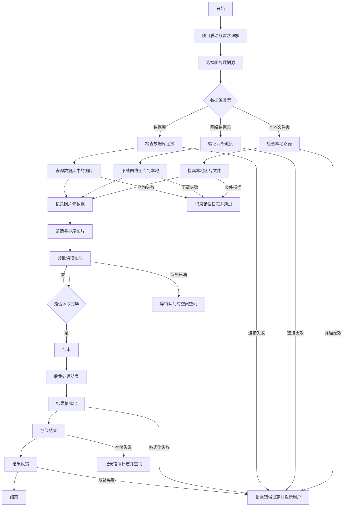

好的，以下是为第一周任务设计的业务流程图和任务报告。

---

### 业务流程图

以下是交通图片信息识别任务的业务流程图，展示了从图片输入到结果输出的完整流程：

### 第一周任务报告

#### 一、项目概述

**项目名称**：交通图片信息识别任务

**项目目标**：利用 Agentic Object Detection API 的能力，开发一套数据管道，实现交通图片的批量读入、多线程调用 API、生成预测结果以及结果分析的完整流程。

**项目周期**：两个月

#### 二、第一周任务目标

1. **熟悉项目需求与技术框架**：深入理解项目目标，明确项目需求和技术实现路径。
2. **完成开发环境搭建**：搭建开发环境，安装必要的工具和依赖库。
3. **完成数据准备**：收集交通图片数据集，进行初步清洗和格式分析。
4. **设计数据管道架构**：设计数据管道的整体架构，绘制流程图，明确各模块的功能和交互流程。

#### 三、具体任务执行

1. **项目需求理解**
   
   - **目标解读**：详细解读 Agentic Object Detection API 的功能，明确其在交通图片信息识别中的应用场景，如车辆检测、行人识别、交通标志识别等。
   - **业务背景学习**：研究交通图片信息识别的业务背景，了解不同交通目标的识别需求及其在交通管理、自动驾驶等领域的应用。
   - **功能需求明确**：确定数据管道需实现的功能，包括图片批量读入、多线程调用 API、生成预测结果、分析结果等。

2. **API 调研与开发环境搭建**
   
   - **API 文档研读**：仔细研读 Agentic Object Detection API 文档，掌握其调用方式（如 HTTP 请求格式、认证方式）、输入输出参数（如图像格式、尺寸要求，预测结果字段含义）、速率限制等关键信息。
   - **开发环境搭建**：安装 Python 编程语言，配置 PyCharm 集成开发环境，安装必要的依赖库（如 `requests` 用于 HTTP 请求，`Pandas` 用于数据处理，`OpenCV` 用于图像读取等）。
   - **项目代码仓库创建**：创建项目代码仓库，建立基本的项目目录结构，包括 `data`（存放数据）、`src`（存放源代码）、`docs`（存放文档）等文件夹。

3. **数据准备与格式分析**
   
   - **数据集收集**：从公开数据集（如 COCO 交通子集）和实际业务场景中收集交通图片数据集，确保数据集包含不同场景、光照条件、拍摄角度的交通图片。
   - **数据格式分析**：分析图片数据格式，包括图像分辨率、颜色模式（RGB 或灰度）、文件类型（JPEG、PNG 等），确定数据管道中图片读入模块的处理方式。
   - **数据清洗**：对数据集进行初步清洗，去除损坏的图片文件，记录图片的元数据（如文件路径、拍摄时间、场景描述等），存储在 CSV 或 JSON 文件中。

4. **数据管道架构设计**
   
   - **架构设计**：设计数据管道的整体架构，明确各模块的功能和交互流程：
     - **图片批量读入模块**：从指定目录或数据源读取图片。
     - **多线程调用 API 模块**：将图片分发给多个线程，并行调用 Agentic Object Detection API。
     - **生成预测结果模块**：收集 API 返回的预测数据并进行格式化处理。
     - **分析模块**：对预测结果进行统计、可视化等分析。
   - **数据传输方式**：确定各模块之间的数据传输方式，如使用队列（Queue）实现线程间的图片和结果传递，确保数据流动的高效性和稳定性。
   - **架构图绘制**：绘制数据管道架构图，清晰展示各模块的关系和数据处理流程，为后续编码提供指导。

#### 四、成果输出

1. **项目需求理解文档**：包含业务目标、功能需求和团队分工。
2. **开发环境搭建报告**：包含环境配置说明和 API 调研报告，附带 API 调用示例代码。
3. **数据准备报告**：包含数据清洗报告和元数据文件。
4. **数据管道架构图**：清晰展示各模块的关系和数据处理流程。
5. **模块功能说明文档**：详细说明各模块的功能和交互流程。

#### 五、总结

本周完成了项目启动与基础准备阶段的任务，深入理解了项目需求，搭建了开发环境，准备了数据集，并设计了数据管道的整体架构。通过这些工作，为后续的开发工作奠定了坚实的基础。下周将进入具体编码阶段，开始实现数据管道的各个模块功能。

---

希望这份任务报告和业务流程图能够帮助你更好地理解和推进项目。如果有任何问题或需要进一步的说明，请随时告知。
